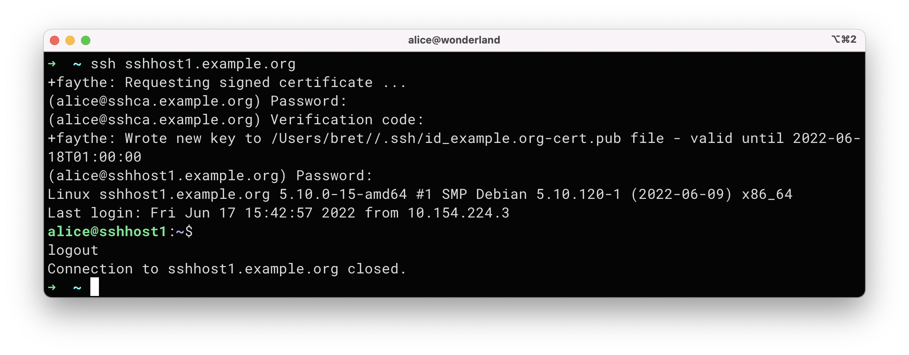
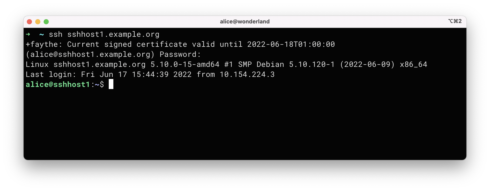
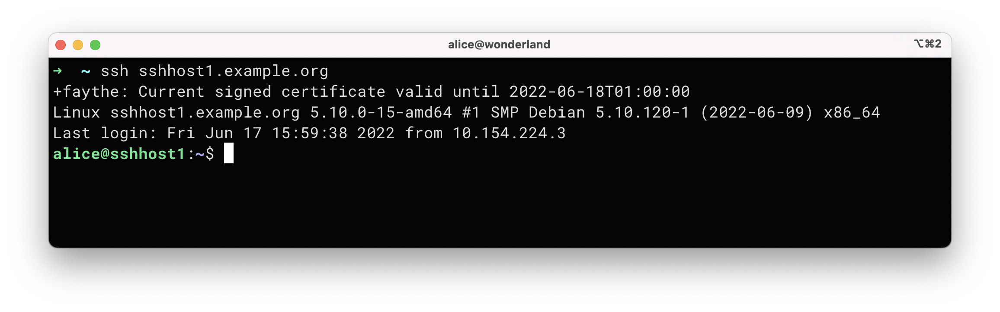
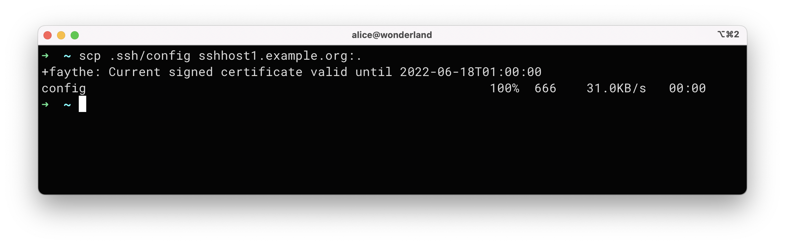
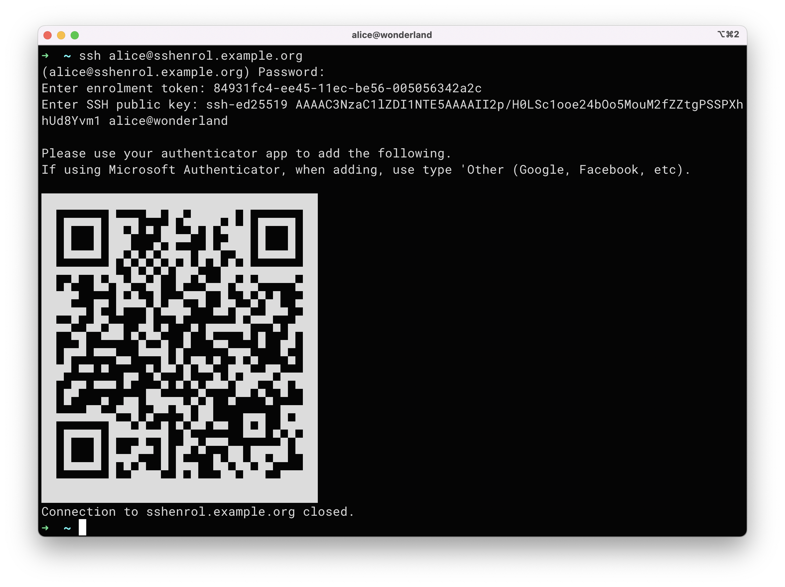

# faythe
An SSH user CA with 2fa/mfa and time limited public keys and optional SSH gateway.

_faythe_[^1] consists of three parts:

1. An SSH trusted CA with 2fa (via google-authenticator) with that signs users' public keys which were previously uploaded in a secure, trusted manner (using ssh of course). By default, signed keys are only valid for 1 day.
2. A set of client scripts to make obtaining signed keys simple and transparent.
3. An optional SSH Gateway for sites that wish to ensure that access via SSH to a site can only be made using trusted, signed public keys.

## Introduction

_faythe_ is a set of client and server scripts designed to make using signed SSH keys transparent and straight-forward for the end users. At the client end, it provides (optional) posix shell or powershell functions to override _ssh_ and _scp_ which check whether the signed key is still current and will prompt for a new 2fa signed key if the current key is expired. At the server end, it provides for signing keys with a limited lifetime using the users' password and google-authenticator for 2fa. Additionally, new users can be enrolled via an enrolment token to facilitate uploading their private key. Finally, a separate SSH gateway can be configured to only trust SSH signed keys.

Note that this only works with OpenSSH command line clients and servers - so use of PuTTY, winscp etc isn't catered for. Now that Microsoft provide a native OpenSSH client, this works on that platform too without having to resort to WSL - though it works fine with WSL too.

## Background

If you use SSH a lot in your work, you are likely to prefer public keys over passwords, probably used in conjunction with an SSH agent. However, for the server administrator, enabling just public keys for authentication can be problematic as you have to trust that your users are using a secure passphrase against their public key. Using signed SSH public keys can partially solve this issue - you can prompt once per-day (or other suitable interval) and return a signed copy of their SSH public valid for that interval - with the ability to encode additional principals in the certificate for delegated access. If the signing process involves 2fa, you can further enhance your security as you now have a greater degree of trust in the initial authenticating and signing and the concerns about how well protected the users' private key are a partially addressed.

# SSH CA Server

The SSH CA server needs the following (assuming debian or Ubuntu)

* Additional packages (libpam-google-authenticator, sudo, bsdutils, uuid, qrencode)
* Modifications to /etc/pam.d/ssh to enable google-authenticator and management of enrolment
* Modifications fo /etc/ssh/sshd_config to match two groups (here called faythe-enrol and faythe-users) and enabling of ChallengeResponseAuthentication.
* An optional file to match group membership to principals
* Modification of /etc/sudoers to allow running ssh-keygen and management of _fayth_enrol_ group.
* Two scripts - one for enroling (_enrol_) and one for re-issuing (_reissue_)

# SSH Clients

The ssh clients need to modify the following files

* ~/.ssh/config  
  One entry for the ssh gateway, ca and enrolment servers  
  One entry for the site/domain where you want to authenticate using the CA signed keys
* .bashrc or .zshrc (linux/mac)  
  Add line to source ~/.config/faythe/faythe.sh
  Recommended aliasing of ssh and scp
* $PROFILE (Windows Powershell)
  Add line to source $env:APPDATA/faythe/faythe.ps1
  Recommended aliasing of ssh and scp
* A _domains_ file to list one or more domains where _faythe_ is used

Once installed correctly, clients can just use ssh or scp a per-usual from the command line and if the signed key needs to be renewed, they will be prompted.

### Format of _domains_ file

The config file _domains_ is used to determine when to use _faythe_ and when to just call standard _ssh/scp_ programs. An example _domains_ file is
```
example.org alice ~/.ssh/id_ed25519_example.org
```

Each line contains (space or tab separated)
1. A domain name - _faythe_ will only intercept if the _ssh_ or _scp_ command references a host in this domain. Also, _faythe_ expects that this domain has hosts _sshca.example.org_ for trusted key renewals, _sshenrol.example.org_ for enrolling of new users and _sshgw.example.org_ for the optional gateway.
2. The login name to use at _example.org_
3. The public key to use at _example.org_ - it is recommended to use _ed25519 certificates and use the naming convention of _id_ed25519_example.org_

Comments can be included and start with a _#_ and extend to the end of the line. Multiple domains are supported.

# SSH Gateway Server

If using the SSH gateway functionality, then the gateway, needs a couple of tweaks in _/etc/ssh/sshd_config_, a per-site file containing user -> allowed hosts file (referenced from _/etc/ssh/sshd_config_ and an optional external command to further validate SSH certificate principals (e.g. to restrict access to the client IP where the certificate was issued from).

# Example client usage

This example shows how the user interaction required.

First connection to a _faythe_ managed domain of the day which causes and automatic redirect to the CA to re-sign the key and then subsequent connecting on to the requested service. Note any informational messages are prefixed with _+faythe:_ and printed to stderr. In these examples, it is assumed the user is _alice_ and you are using a variant of the default ssh _config_ settings.



Then a subsquent connection to the same or different host in the same domain:



In this example, on _sshhost1.example.org_, alice has added the following to her _.ssh/authorized_keys_ file

```
cert-authority,principals="alice" ssh-ed25519 AAAAC3NzaC1lZDI1NTE5AAAAIAvoR1MaEiuA/JAkInq+NK1ReeCVBAJFxCN8N3fTZ5An faythe-user-ca@example.org
```

and this host allows authentication by public keys - so the password is not required.



However, it would be better for the site to only allow access through an sshgw which can be configured to only accept signed keys with restrictions on what hosts that user/key can access.

Finally, an example of scp - this too would prompt for password and 2fa if it was the first connection of the day ...



# Enrolling a new user

Assuming that you have sent an enrolment token to a user, they can self-enrol their public key by ssh'ing to sshenrol.example.org:



At this point, they can use google-authenticator or similar to add the identity for later use.

[^1]: See https://en.wikipedia.org/wiki/Alice_and_Bob